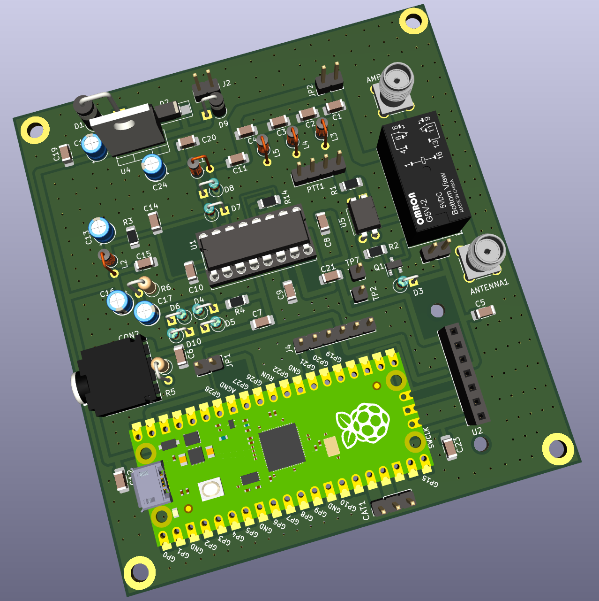

#### PDX

A port of https://github.com/WB2CBA/ADX/ to Raspberry Pi Pico.

PDX-v3 is like v2 but is adapted for manufacturing @ JLCPCB.

PDX-v4 is like v3 with minor bugfixes.

PDX-v5 is like v4 with ADC-voltage-limiting circuit.

Bands covered: 80-meter to 15-meter.

FT8 is natively decoded on the Pico using the code from the following
repository:

https://github.com/kholia/pico_ft8_xcvr

The `PDX RX Block` when combined with the following project becomes a complete
5W (to 10W!) digital FT8 transceiver.

- https://github.com/kholia/HF-PA-v6/tree/master/HF-PA-Combined

  Solid 3W+ on 15m, 6W+ on 20m, 10W+ on 40m band. All @ 13.8v only!

  Set high gate bias (even 4.2v!) for IRF510 for clean linear output.

The live FT8 audio can also be decoded on PC / RPi / Android phone.

#### BOM Sources

International users can buy from Mouser and DigiKey.

Here are some local BOM sources I use:

- https://inkocean.in/ - CD2003 (Chinese clone which is known to work fine)

- https://www.electronicscomp.com/ (SMD resistors + SMD caps + THT inductors)

  - All SMD caps and resistors are 1206 sized

- https://www.ktron.in/ (SMA connectors)

- https://www.comkey.in/ - Branded SMD stuff

- https://rarecomponents.com/store/1002 - NXP 1N4148

- https://projectpoint.in/ - CDIL 7805, PJ307 Stereo Socket

- https://www.evelta.com/l7805-positive-voltage-regulator-1-5a-5v/ (alternate)

- https://robu.in/product/si5351a-i2c-8-khz-160-mhz-clock-generator-breakout-board-module/

- https://robu.in/product/raspberry-pi-pico/

- https://etstore.in/ - OEN MICRO RELAY 46-05-2C

#### Credits

- https://github.com/WB2CBA/ADX/

- https://www.qrz.com/DB/VU2BGS

#### References

- https://f5npv.wordpress.com/homebrew-ft8qrp-afp-fsk-trx/
