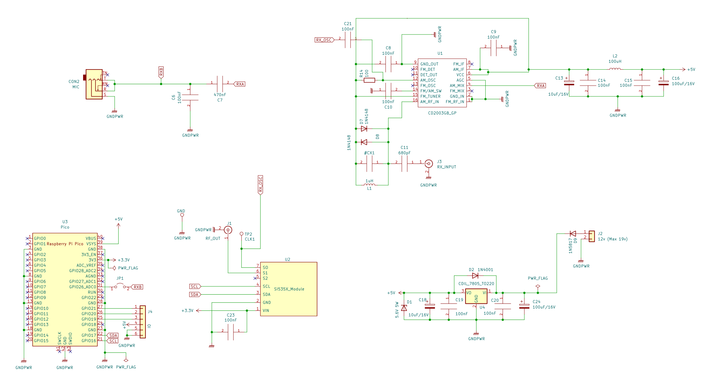

#### PDX

[UPDATE] Check out [PDX-v2](https://github.com/kholia/Easy-Transceiver/tree/master/PDX-v2)
instead ;)

A port of https://github.com/WB2CBA/ADX/ to Raspberry Pi Pico.

FT8 is natively decoded on the Pico using the code from the following
repository:

https://github.com/kholia/pico_ft8_xcvr

The `PDX RX Block` when combined with the following projects becomes a complete
digital FT8 transceiver.

- https://github.com/kholia/Simple-TR-Switch

- https://github.com/kholia/HF-PA-v6

The live FT8 audio can also be decoded on PC / RPi / Android phone.

#### Notes

PIN39 VSYS (used to power system, can be in range 1.8V-5.5V).

#### BOM Sources

International users can buy from Mouser and DigiKey.

Here are some local BOM sources I use:

- https://inkocean.in/ - CD2003 (Chinese clone which is known to work fine)

- https://www.electronicscomp.com/ (SMD resistors + SMD caps + THT inductors)

- https://www.ktron.in/ (SMA connectors)

- https://www.comkey.in/ - Branded SMD stuff

- https://rarecomponents.com/store/1002 - NXP 1N4148

- https://projectpoint.in/ - CDIL 7805, PJ307 Stereo Socket

- https://www.evelta.com/l7805-positive-voltage-regulator-1-5a-5v/ (alternate)

- https://robu.in/product/si5351a-i2c-8-khz-160-mhz-clock-generator-breakout-board-module/

- https://robu.in/product/raspberry-pi-pico/

#### Credits

- https://github.com/WB2CBA/ADX/
