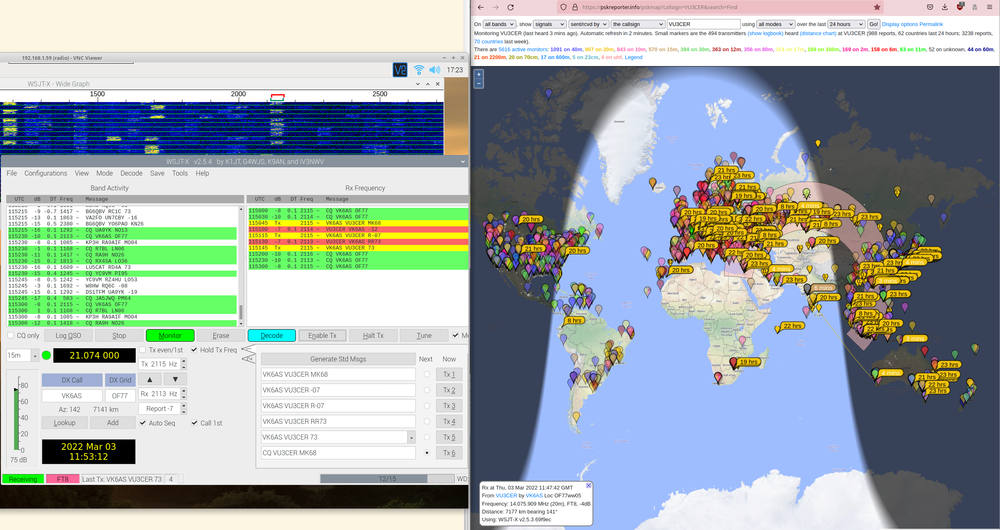

### Easy-Transceiver

The whole design is modular, parametric (cost and others), field repairable,
and super extensible. It is almost trivial to add support for more `FSK digital
modes`.

The `Easy-Transceiver` hardware works with the native `Hybrid FT8 Radio`
Android app, and also with WSJT-X (running on RPi).

The `Easy-Transceiver` system can be built for around 3000 INR (~40 USD) or
less. We are working on reducing the cost to 2300 INR ;)

Author 1: LU2HES - https://github.com/agustinmartino

Author 2: Dhiru Kholia (VU3CER) - https://www.qrz.com/db/VU3CER/

TX chain:


RX chain (Easy-uSDX - optionally headless):


QSO(s):




QSOs over 15000 kms were made using this HW with PA150 (with around 37W ERP).


#### Notes

This will need a HF RF PA in most cases to be usable on the air.

UPDATE (January 2022): Check out our [cost-effective, and robust HF PA system](https://github.com/kholia/HF-PA-v5/).


#### Setup

- Use Python 3.10.x for maximum compatibility.

- Setup dependencies.

  `pip install -r requirements.txt`


#### T/R Switch

Check out our [cost-effective, and simple T/R switch design](https://github.com/kholia/Simple-TR-Switch/).


#### BCI Filter

Are you hearing broadcast AM signals in the background of the uSDX receiver? If
yes, a simple `BCI filter` can solve this problem easily enough.

Checkout the [RX BCI Filter](./HPF-BCI-Filter-RX) included in this repository.


#### BOM

- High Quality Female to Female Jumper Wire - 2500mA (Project Point)

- Female and male berg strip

- Arduino Nano v3 board - 450 INR - We will eliminate this requirement soon

- SN74CB3T3253DR (SOIC-16, Semikart) - ~200 INR

- Bunch of 100nF MLCC - 25 INR ('Emerging Technologies' Store -> ET)

- Bunch of 10nF MLCC - 10 INR

- Bunch of 1nF MLCC - 20 INR

- 4 x 470nF MLCC - 10 INR

- 1 x 1N5819 - 2 INR

- 1 x 1N4007 - 2 INR

- 1 x 7805 Linear Regulator - 15 INR

- 2 x 100uH inductor - 12 INR

- Si5351 Module - 470 INR (no delicate soldering required!)

  - Cheaper to get MS5351M from LCSC (in bulk for more experiments) - <= 100 INR

- Bunch of 10k resistors (MFR, ET / Project Point) - 25 INR

- Bunch of 1k resistors - 10 INR

- 1 x 1k 0.5W resistor - 5 INR

- 1 x 470 0.25W resistor - 5 INR

- 2 x 82k 0.25 resistor (MFR) - 5 INR

- 4 x 100 Ohm resistor (MFR) - 5 INR

- 1 x 3.5mm Stereo Socket ('PJ-307', https://www.electroncomponents.com/Stereo-Socket-3.5mm-connector-pcb) - 12 INR

- BCI Filter BOM - 2 x 2.2nF ceramic capacitor, 2 x 820pF (can be resistor shaped!), 3 * 2.2uH inductor axial

- 2 x SMA connectors (https://www.ktron.in/, SMA Straight - Female - Vertical Mount) - 50 INR

- ATmega328P (DIP-28) - 225 INR

- 20 MHz crystal - 10 INR

- LM4562NA - 220 INR (Semikart) OR NE5532AP (130 INR from Semikart, 30 INR locally from https://rarecomponents.com)

  The `NE5532` is widely faked - even https://www.electronicscomp.com/ sells a cheap knockoff!

  TIP: Get `TI make NE5532` from https://rarecomponents.com/.

- Misc: Copper clad board (glass epoxy one), Relimate male connectors + female
  cable, Male berg strip, Female-to-female dupont cables

  Get from https://www.electronicscomp.com/ and https://projectpoint.in/ shops.

- Total: Around 1500 to 1600 INR


#### BOM Sources

- https://robu.in/ (https://www.ktron.in/ has better pricing at times)

- https://www.electronicscomp.com/ (2.2uH Inductor)

- https://projectpoint.in/ (222 MLCC, 820pF MLCC)

- https://www.electroncomponents.com/2.2uh-inductor-inductance-coil (2.2uH Inductor)


#### Tips

Useful commands:

```
pacmd load-module module-null-sink sink_name=Virtual0
pacmd update-sink-proplist Virtual0 device.description=Virtual0
pacmd update-source-proplist Virtual0.monitor device.description=Virtual0
```

Use Gqrx and WSJT-X with a SDR device for initial frequency adjustment /
calibration. This is essential for WSPR functionality. FT8 is more
robust/tolerant of frequency deviations due to a much larger RX window.


#### References + Credits

- https://github.com/WB2CBA for the uSDX PCB

- https://github.com/kgoba/ft8_lib

- https://github.com/etherkit/JTEncode

- https://learn.adafruit.com/adafruit-si5351-clock-generator-breakout/wiring-and-test

- https://github.com/agustinmartino/wsjt_transceiver

- https://github.com/agustinmartino/wsjtx_transceiver_interface

- https://www.qrp-labs.com/synth/ms5351m.html

- https://github.com/kholia/Easy-Digital-Beacons-v1

- https://github.com/kholia/HF-Balcony-Antenna-System (fun!)

- https://github.com/kholia/SMPS-Noise-Filter
